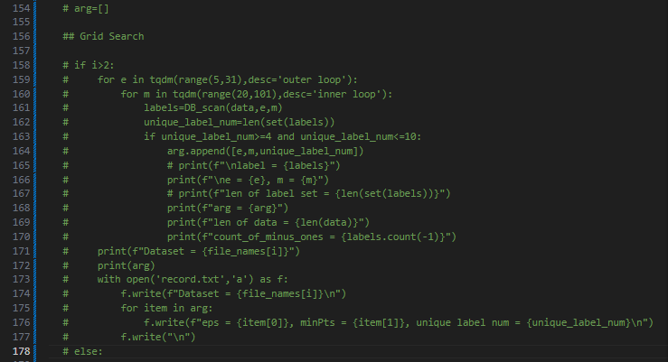
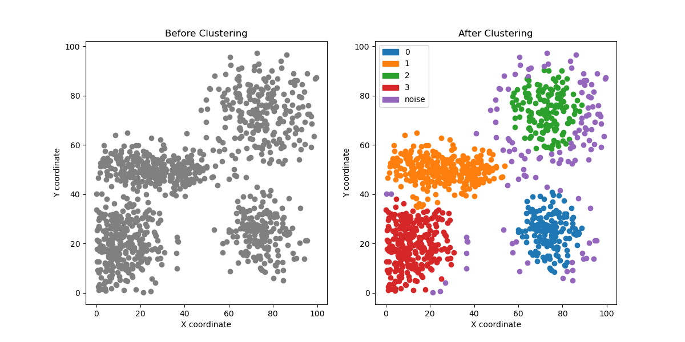
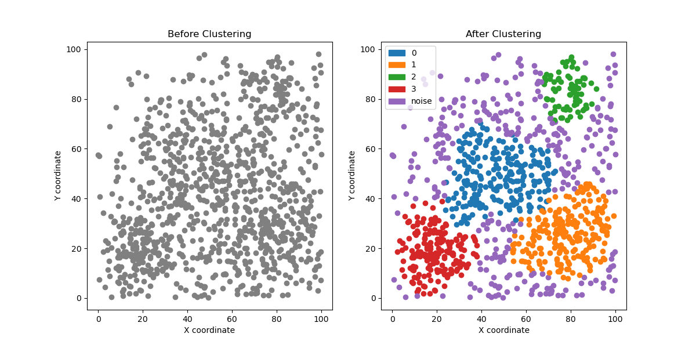
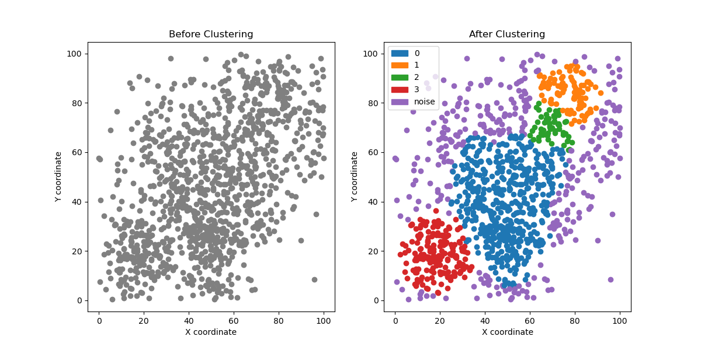
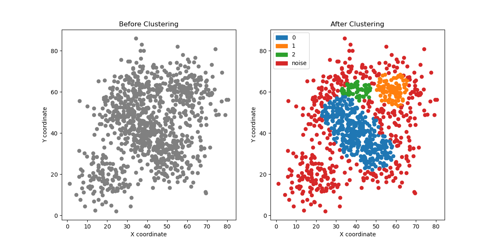
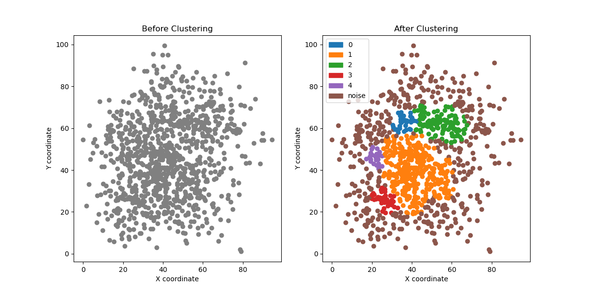

# Clustering
> python my_clustering.py
## Experiments
> Using DB-SCAN algorithm,and perform grid search method to find the better (eps,minPts).

* ### Clusrering_test1
    * #### eps:8
    * #### minPts:39
    * #### num of cluster:4 (without noise)
    * #### plot:

----------------------------------------------------

* ### Clusrering_test2
    * #### eps:8
    * #### minPts:33
    * #### num of cluster:4 (without noise)
    * #### plot:

----------------------------------------------------

* ### Clusrering_test3
    * #### eps:7
    * #### minPts:31
    * #### num of cluster:4 (without noise)
    * #### plot:

----------------------------------------------------

* ### Clusrering_test4
    * #### eps:5
    * #### minPts:39
    * #### num of cluster:3 (without noise)
    * #### plot:

----------------------------------------------------

* ### Clusrering_test5
    * #### eps:6
    * #### minPts:37
    * #### num of cluster:3 (without noise)
    * #### plot:

